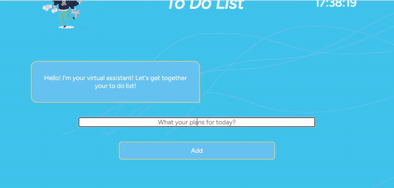

  <h1>📝 To-Do List App</h1>

  
  
  
  

  

  

  

## 📱 Mobile Friendly / Responsive

Alle Projekte sind vollständig responsive und für folgende Geräte optimiert:

- Desktop
- Tablet
- Mobile

Layouts, Menüs und interaktive Elemente passen sich automatisch an verschiedene Bildschirmgrößen an, um eine optimale Benutzererfahrung auf Smartphones und Tablets zu gewährleisten.

---

## 📝 Über die App 
Dies ist eine einfache To-Do List Anwendung, die es Benutzern ermöglicht:
Aufgaben hinzuzufügen
Aufgaben als erledigt zu markieren
Aufgaben zu löschen
Aufgaben im lokalen Speicher zu speichern
Die App zeigt grundlegende DOM-Manipulation, Event-Handling und die Arbeit mit localStorage in JavaScript.

---

## 🔧 Sprachen und Tools
🛠️ Sprachen und Tools
HTML
CSS
JavaScript

---

## 🔧 Projekt lokal starten

Dieses Projekt benötigt keine zusätzliche Installation oder Abhängigkeiten.

1. Repository klonen:
   `bash
   git clone https://github.com/Alisa-Popovuch/To-Do-List.git
3. Projektordner öffnen
4. Die Datei index.html im Browser öffnen

---

## 📚 Was ich gelernt habe 
DOM-Manipulation
Event-Handling in JavaScript
Arbeit mit localStorage
Dynamische UI-Aktualisierung

---

## 🚀 Mögliche Erweiterungen 
Drag & Drop für Aufgaben-Reihenfolge
Kategorien oder Prioritäten
Filter für erledigte/nicht erledigte Aufgaben
Verbesserung der mobilen Darstellung

---

## 📝 Hinweise
Dieses Projekt kann zu Lern- und Übungszwecken verwendet werden.

---

## 🌐 Live-Demo
👉 https://you-to-do-list.netlify.app/

---

  <h1>📝 To-Do List App</h1>

  
  
  
  

  

---

## 📱 Mobile Friendly / Responsive

All projects are fully responsive and optimized for:

- Desktop
- Tablet
- Mobile

This means layouts, menus, and interactive elements adapt to different screen sizes, ensuring a smooth experience on phones and tablets.

---

## 📝 About the App

This is a simple To-Do List application that allows users to:

- Add tasks  
- Mark tasks as completed  
- Delete tasks  
- Persist tasks in local storage  

The app demonstrates basic DOM manipulation, event handling, and working with localStorage in JavaScript.

---

## 🛠️ Languages and Tools 

- HTML  
- CSS  
- JavaScript  

---

## 🔧 How to Run Locally

1. Clone the repository:
   `bash
   git clone [https://github.com/Alisa-Popovuch/Virtual-Cosmetologist.git](https://github.com/Alisa-Popovuch/To-Do-List.git)
2. Open the project folder
3. Open index.html in your browser

---

## 📚 What I Learned 
- DOM manipulation
- Event handling in JavaScript
- Working with localStorage
- Updating UI dynamically

---

## 🚀 Future Improvements 
- Drag & Drop to reorder tasks
- Categories or priorities
- Filter completed/uncompleted tasks
- Improve mobile responsiveness

---

## 📝 Notes
This project may be used for educational purposes.

---

## 🌐 Live Demo
👉 https://you-to-do-list.netlify.app/

